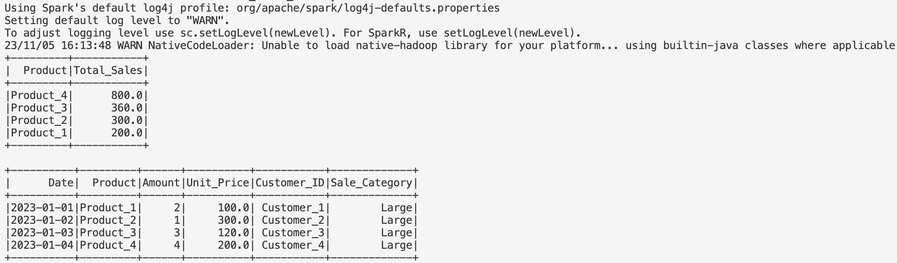

# ids706-week10-pyspark 

### Requirements
- Use PySpark to perform data processing on a large dataset
- Include at least one Spark SQL query and one data transformation
### Grading Criteria
- Data processing functionality (20 points)
- Use of Spark SQL and transformations (20 points)
### Deliverables
- PySpark script
- Output data or summary report (PDF or markdown)

# Sales Data Processing with PySpark

This project demonstrates how to process a sales dataset using PySpark. The script performs data transformations and executes Spark SQL queries to calculate the total sales per product and find the top-selling products.

## Prerequisites

- Apache Spark
- PySpark
- Python 3.x

Ensure that Java 8 or 11 is installed on your system because PySpark depends on the JVM (Java Virtual Machine).

This will initiate the Spark session and process the embedded sales data within the script.

## Output
### The script will output two tables:

- The top 10 selling products based on total sales.
- The original dataset with an additional column, Sale_Category, which categorizes each sale as 'Small' or 'Large' based on the total sale amount.

## Generating Summary Report
### To generate a summary report, follow these steps:

- Run the script as mentioned above.
- The output will be displayed in the console.

